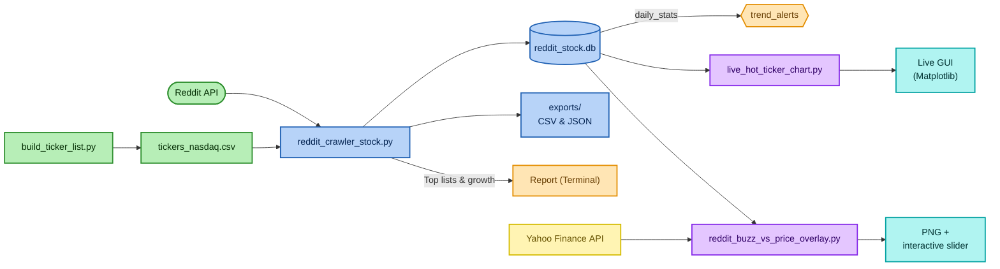

# 📈 Reddit-Stock-Crawler

A **fully automated Reddit-Stock-Crawler written in Python** that

* **Extracts** every new submission & comment from _any_ subreddit in real time  
  (thanks to PRAW / Pushshift fallback)
* **Transforms** raw text into clean, de-duplicated **stock-ticker hits**
* **Loads** every match into a tiny, blazing-fast **SQLite** database – no
  external services, no APIs, no cloud

Once per day the job

* compiles **buzz statistics** (mentions, unique authors, karma, etc.),
* compares them with rolling baselines and
* emits **simple trend alerts** right to your terminal or Telegram bot.

---

## Table of Contents
1. [Goal](#goal)
2. [Architecture](#architecture)
3. [Script Overview](#script-overview)
4. [Requirements](#requirements)  
   4.1 [Quick Setup](#quick-setup)
5. [Step-by-Step Guide](#step-by-step-guide)
6. [Output](#output)
7. [Example Results](#example-results)
---

## Goal

`Reddit-Stock-Crawler` is a collection of small, self-contained Python scripts that together form a complete ETL pipeline:

1. Fetch posts & comments from one or more subreddits (default: **r/wallstreetbets**).  
2. Detect stock tickers in the text (`AAPL`, `TSLA`, …).  
3. Write both raw data and matches (“mentions”) to a **SQLite** database.  
4. Every day the crawler automatically produces  
   • a **Top-15 leaderboard** of the most-mentioned tickers, and  
   • simple **trend alerts** whenever a symbol crosses a configurable threshold  
     (default: ≥ 10 mentions that day).  
5. Data can be exported as **CSV** or **JSON** at any time.  
6. Extra helper scripts create  
   • a **live bar chart** of today’s hottest tickers, and  
   • an interactive **3-D “Buzz vs. Price”** plot with a slider.

The whole workflow obeys Reddit rate limits, logs verbosely, and needs **no server  
infrastructure** – everything runs locally and writes only local files.

---

## Architecture



## Script Overview

| Script | Purpose |
| ------ | ------- |
| `reddit_crawler_stock.py` | Crawls selected subreddits, identifies stock ticker symbols, writes the results to the database, and generates a consolidated report. |
| `build_ticker_list.py` | Creates and updates the ticker whitelist (`tickers_nasdaq.csv`). |
| `reddit_buzz_vs_price_overlay.py` | Produces a 3-D plot and a 2-D overlay to compare Reddit “buzz” with the daily closing price of each ticker. |
| `live_hot_ticker_chart.py` | Displays a real-time bar chart showcasing today’s top-mentioned tickers. |


## Requirements

Before you get started, make sure your environment meets **all** of the following requirements.

| Category             | Details                                                                                                                     |
| -------------------- | --------------------------------------------------------------------------------------------------------------------------- |
| Python               | Version **3.11** or higher                                                                                                  |
| Required libraries   | `praw`, `python-dotenv`, `tqdm`, `pandas`, `matplotlib`, `tabulate`, `yfinance`, `pandas-market-calendars`, `wordfreq`       |
| Reddit API access    | A free Reddit account **and** API credentials: `client_id`, `client_secret`, `username`, `password`                         |
| Database             | Writable SQLite database file <br>_(the application will automatically create the file on the first run if it is missing)_ |

### Quick Setup

```bash
# 1. Create and activate a virtual environment (recommended)
python -m venv .venv
source .venv/bin/activate      # On Windows: .venv\Scripts\activate

# 2. Install all Python dependencies
pip install -r requirements.txt
```

## Step-by-Step Guide

The following guide takes you from an empty directory to running analyses and visualizations in eight steps.
All commands work on macOS / Linux (Bash).
For Windows replace source …/activate with
.venv\Scripts\activate and call the Python scripts with python instead of ./python.

---

### 1  Clone / Update the Repository
```bash
git clone https://github.com/<DEIN-USER>/reddit-stock-crawler.git
cd reddit-stock-crawler
```

### 2 Virtual Environment + Dependencies
```bash
python -m venv .venv
source .venv/bin/activate      # activate / deactivate
pip install -r requirements.txt
```
### 3 Add Reddit API Credentials

Create a file called .env in the project root (a template is provided as .env.example):

```bash
REDDIT_CLIENT_ID=xxxxxxxx
REDDIT_CLIENT_SECRET=xxxxxxxx
REDDIT_USERNAME=my_reddit_user
REDDIT_PASSWORD=s3cr3t
USER_AGENT="reddit-stock-crawler by <name>"
```

### 4 Generate Ticker Whitelist (one-time)

```bash
python build_ticker_list.py        # creates »tickers_nasdaq.csv« (~5 000 symbols)
```

### 5  Start the Main Crawler

```bash

python reddit_crawler_stock.py \
       --posts 50 \        # number of new posts to ingest
       --comments 200 \    # max. comments per post
       --verbose           # detailed logging
```
### 6 Inspect the Database (optional)

The SQLite file can be opened with DBeaver:

```bash

# quick console check
python -m sqlite3 reddit_stock.db ".tables"

# graphical view (recommended)
dbeaver reddit_stock.db

```
### 7  Live Dashboard & Analyses


```bash
# live bar chart of today’s top tickers
python live_hot_ticker_chart.py

# 3-D plot “Buzz vs. Price” with interactive slider
python reddit_buzz_vs_price_overlay.py
```

## Output

After one run you will have:

    1. A populated SQLite DB containing (among others) the tables
    subreddits, redditors, posts, comments, mentions, daily_stats, trend_alerts.
    2. Up-to-date daily metrics per ticker in daily_stats.
    3. New entries in trend_alerts, if thresholds have been exceeded.
    4. Fresh JSON and CSV files in the exports/ folder for further processing in
    Pandas, Excel, BI tools, etc.

---

## Example Results
